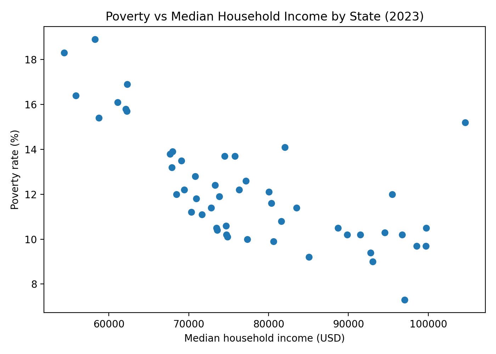
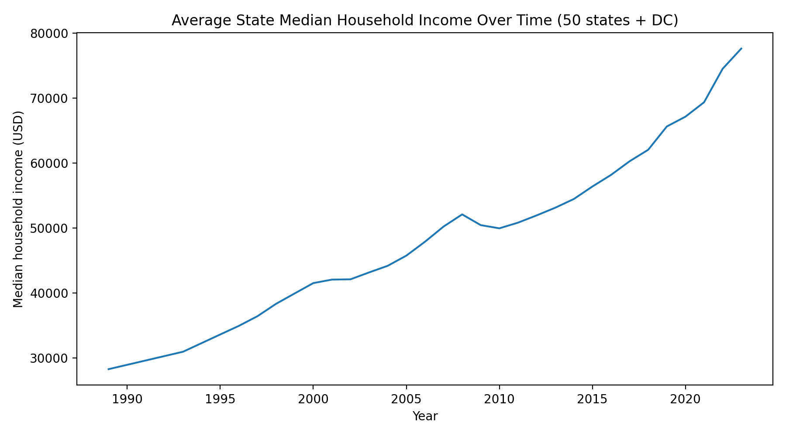
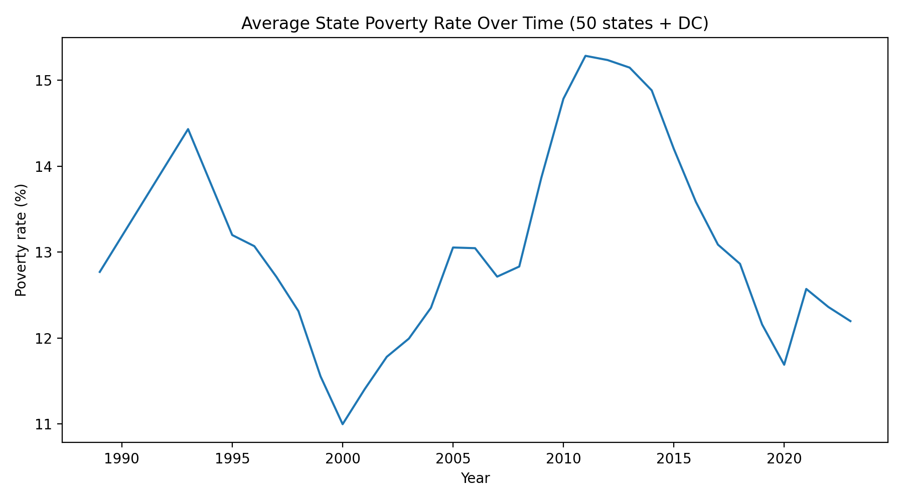
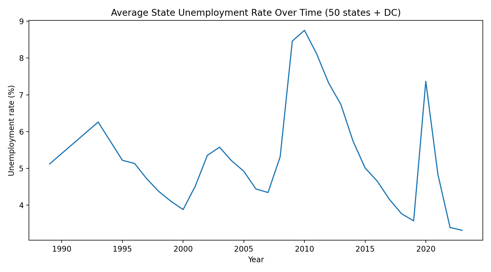
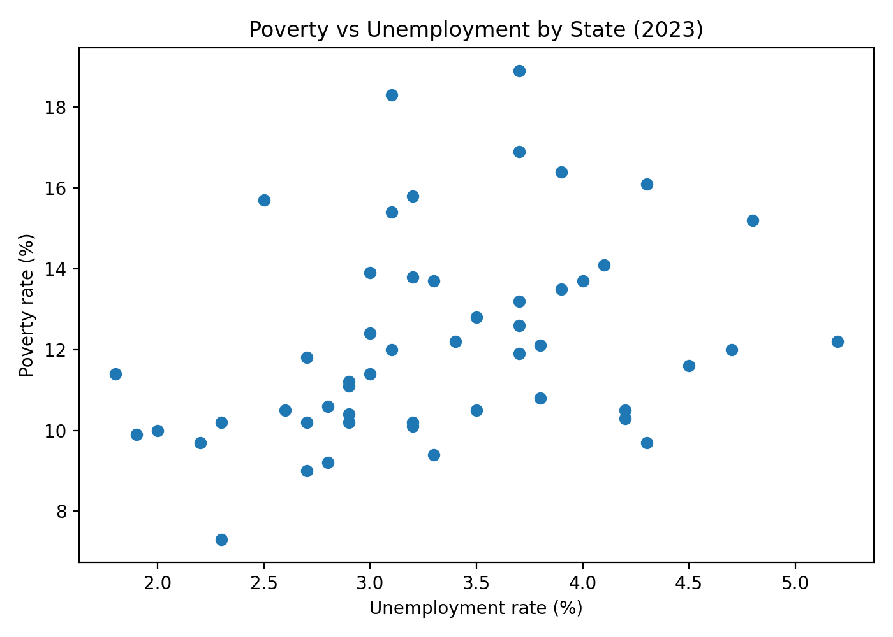

# Economic Conditions & Poverty in the United States  
### A State–Year Panel Analysis (1989–2023)

**Author:** Trevor Reader  
**Focus:** Political analytics · public policy · applied economic analysis  
**Tools:** Python (pandas, statsmodels, matplotlib), U.S. Census & BLS data

---

## Project Motivation

Poverty is one of the most frequently cited outcomes in U.S. political debate, yet empirical discussion often relies on isolated statistics or single-year comparisons. For policy analysis, that framing is limiting.

This project was built to answer a more policy-relevant question: **how do economic conditions relate to poverty outcomes across states and over time?**

Rather than chasing causal claims, the focus is on building **clean, longitudinal evidence** that supports:
- cross-state comparison  
- historical context  
- transparent, reproducible analysis  

This mirrors how data is actually used in government agencies, think tanks, and political analytics teams.

---

## Snapshot: Income and Poverty Across States (2023)



*Across states, higher median household income is strongly associated with lower poverty rates, though substantial dispersion remains even among high-income states.*

---

## Data Sources

All data come from authoritative, publicly available U.S. government sources commonly used in policy research:

- **U.S. Census Bureau – SAIPE**
  - Poverty rate
  - Median household income
- **Bureau of Labor Statistics – LAUS**
  - Annual state unemployment rates

The analysis spans **1989–2023**, covering multiple economic cycles including the early-1990s recession, the Great Recession, and the COVID-19 shock.

---

## What This Project Does

### 1. Reproducible Data Construction
- Ingests raw Census and BLS data
- Standardizes state identifiers and year formats
- Harmonizes variable definitions across sources
- Produces a clean, analysis-ready **state–year panel**
- Stores intermediate outputs using efficient Parquet format

The result is a dataset suitable for repeated policy analysis and extension.

---

## Long-Run National Trends







*National averages reflect clear cyclical dynamics across economic expansions and downturns, including sharp unemployment and poverty increases during the Great Recession and the COVID-19 period.*

---

## Cross-State Labor Market Context (2023)



*While poverty is positively associated with unemployment, the relationship is weaker and more dispersed than the income–poverty relationship, reinforcing that unemployment alone is an incomplete proxy for economic well-being.*

---

## Statistical Modeling

Baseline regression models are used to quantify observed relationships between poverty, income, and unemployment.

- Model specifications are intentionally conservative
- Results are interpreted as **descriptive associations**, not causal estimates
- Assumptions and limitations are explicitly acknowledged

This reflects how applied analysts responsibly communicate findings in policy settings.

---

## Key Takeaways for Policy Analysis

- Poverty outcomes are tightly linked to household income levels across states, underscoring the importance of wage growth and income supports.
- Labor market conditions matter, but unemployment alone does not explain cross-state poverty differences.
- State-level variation remains substantial even in the same year, suggesting an important role for institutional, demographic, and policy factors.

---

## Project Structure

```text
notebooks/
├── 00_fetch_saipe.ipynb        # Data acquisition & preprocessing
├── 01_build_state_year_panel.ipynb
├── 02_eda.ipynb               # Exploratory analysis & visualization
└── 03_modeling.ipynb          # Statistical modeling

data/
├── raw/                        # Source files (not committed)
└── processed/                 # Cleaned panel datasets

reports/
└── figures/                   # Publication-ready figures
